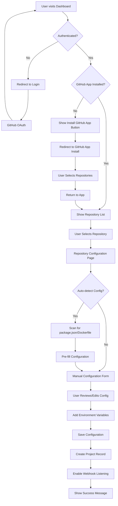
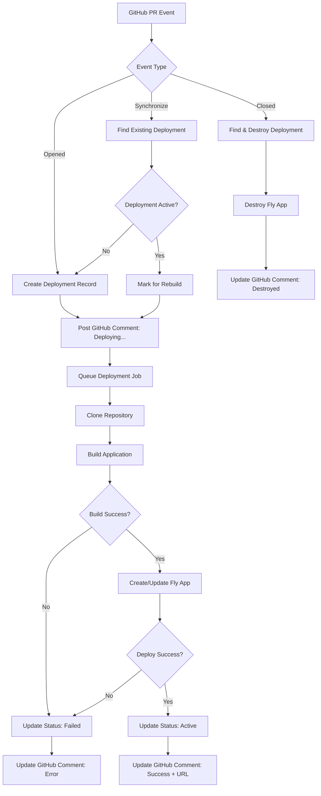
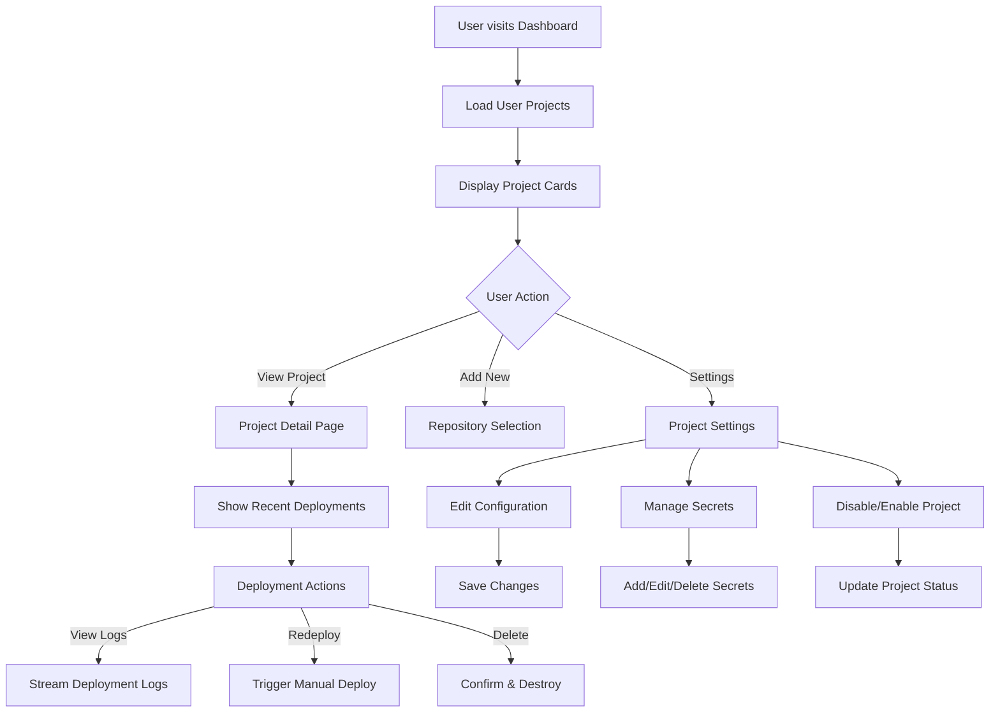
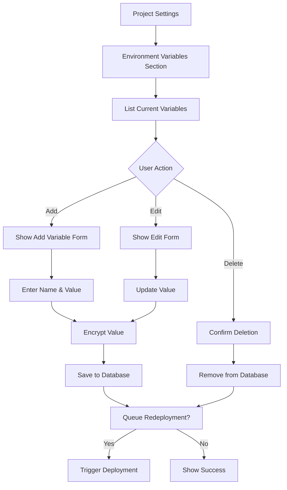

# User Flow Diagrams

## 1. Initial Repository Setup Flow

## 2. PR Deployment Flow (Automated)

## 3. Dashboard Management Flow

## 4. Environment Variable Management

## UI Components Needed

### 1. Dashboard Page (`/dashboard`)
- Project grid/list view
- Quick stats (active deployments, recent activity)
- Add new project button
- Search/filter functionality

### 2. Repository Selection (`/setup/select-repo`)
- List of available repositories from GitHub
- Installation status indicators
- Repository search
- Selection confirmation

### 3. Project Configuration (`/setup/configure/[repo]`)
- Configuration form with sections:
  - Build settings (commands, dockerfile)
  - Runtime settings (port, start command)
  - Environment variables
- Auto-detection status
- Save & activate button

### 4. Project Detail (`/projects/[id]`)
- Project overview
- Deployment history table
- Recent logs preview
- Quick actions (settings, disable, delete)

### 5. Deployment Detail (`/deployments/[id]`)
- Status timeline
- Full logs viewer
- Deployment metadata
- Action buttons (redeploy, destroy)

### 6. Settings Page (`/projects/[id]/settings`)
- Configuration editor
- Environment variables manager
- Danger zone (disable/delete project)

## Key User Experience Principles

1. **Progressive Disclosure**: Start with auto-detection, allow manual override
2. **Real-time Feedback**: Show deployment progress with live updates
3. **Error Recovery**: Clear error messages with actionable next steps
4. **Sensible Defaults**: Pre-fill common configurations
5. **Security First**: Encrypt secrets, validate inputs, show security warnings

## Implementation Priority

1. **Phase 1**: Basic repository connection and configuration
2. **Phase 2**: Deployment status tracking and GitHub integration
3. **Phase 3**: Dashboard and management features
4. **Phase 4**: Advanced features (logs, metrics, custom domains)